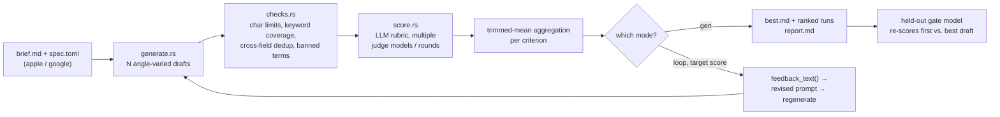
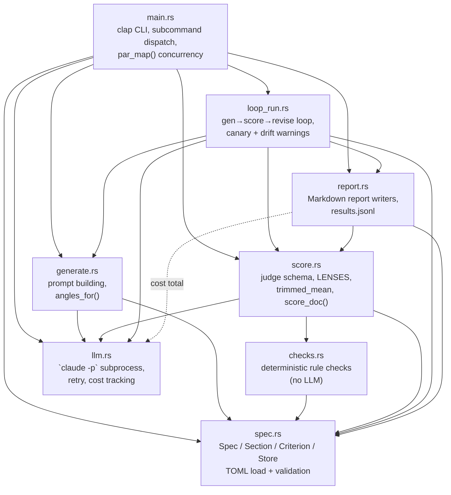
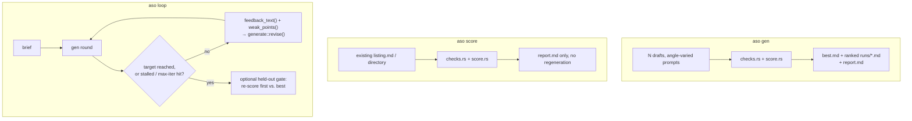
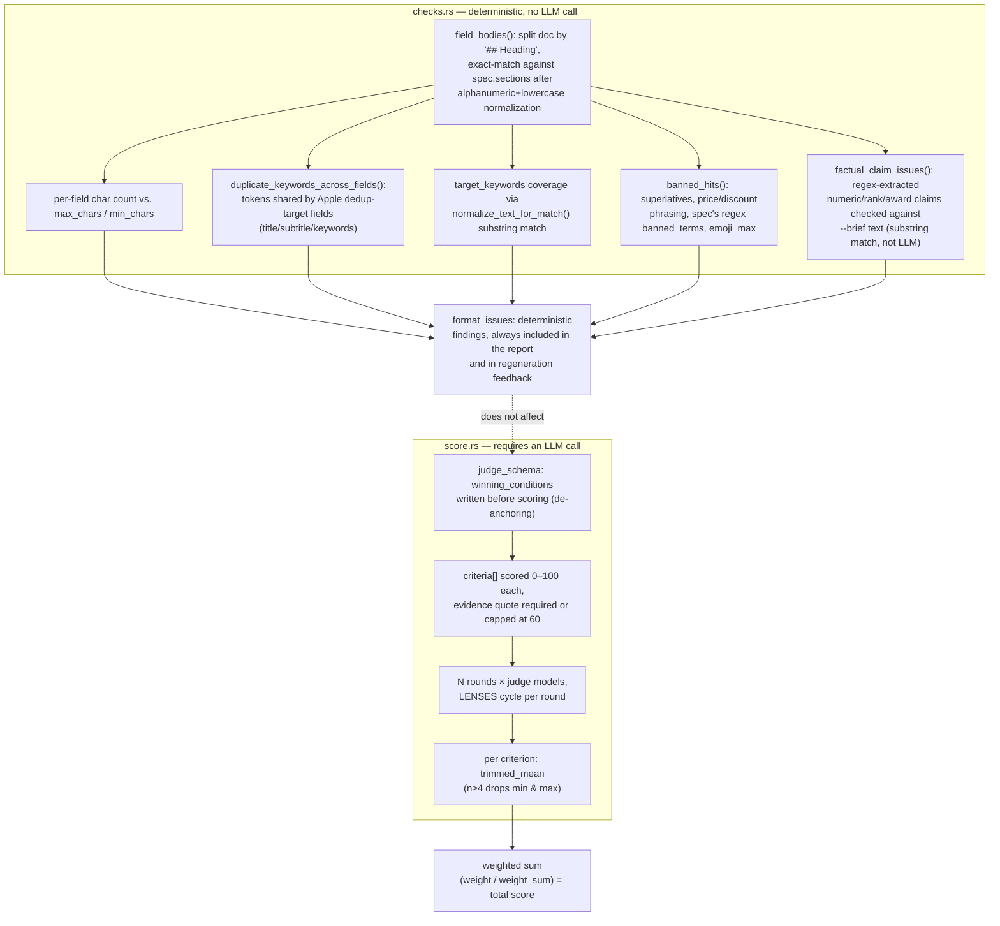
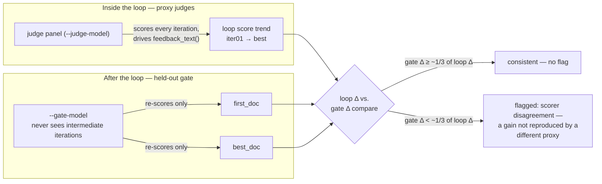

# aso-loop

A Rust CLI that drafts app-store listing copy (title / subtitle / keywords / description) and scores it with an LLM rubric, in a loop: **generate N angle-varied drafts → deterministic rule checks → LLM rubric scoring → feedback-driven regeneration.**

The LLM backend is the Claude Code CLI (`claude -p`) invoked as a subprocess — no separate API key or SDK dependency. The binary is named `aso` (see `Cargo.toml`'s `[[bin]]` entry).

## What it actually does

Given a TOML spec (which store, which fields, character limits, target keywords, banned terms, scoring rubric) and a plain-text brief describing the app, `aso` can:

- **`aso gen`** — generate `N` drafts with different competitive angles, run deterministic checks and LLM rubric scoring on each, and produce a ranked report.
- **`aso score`** — score an existing listing file (or directory of files) against a spec, with no generation.
- **`aso loop`** — repeatedly generate → score → turn the scoring feedback into a revision prompt → regenerate, until a target score is reached or the loop stalls, then optionally re-score the first and best drafts with a model that never participated in the loop (a "held-out gate," aimed at catching cases where the loop's own scorer was gamed).

Two store targets are supported out of the box, encoded as bundled example specs: `specs/example-apple.toml` (Apple App Store: title/subtitle/keywords/promo_text/description) and `specs/example-google.toml` (Google Play: title/short_description/long_description). Both example specs use the same sample app ("MoneyFlow," a budgeting app) purely to illustrate the spec format — the tool itself is domain-agnostic within "app store listing copy."

## Relationship to Loop-Suite

Per `NOTICE`, this project ports the CLI structure, the `claude -p` subprocess backend (`src/llm.rs`), the loop/gate logic (`src/loop_run.rs`), and the report format (`src/report.rs`) from [`Loop-Suite/bizplan-loop`](https://github.com/Loop-Suite/bizplan-loop) — the same "generate N → rule-check → LLM rubric score → regenerate" pattern, there applied to business-plan drafting. The subprocess invocation shape, the stdin/stdout-on-separate-threads handling, JSON-schema enforcement, and the de-anchoring / trimmed-mean / held-out-gate scoring mechanics are unchanged from the original; only the domain logic — spec fields, deterministic checks, prompts — is new to this repo.

## Pipeline overview



## Architecture (module map)

`src/main.rs` is the only module every other module is reachable from; `src/spec.rs` and `src/llm.rs` are leaves with no dependency on the rest of the crate.



## CLI modes



## Usage

```bash
cargo build --release   # target/release/aso
```

```bash
# 1) generate N drafts, score, and rank them
aso --model sonnet --judge-model haiku \
  gen --spec specs/example-apple.toml --brief brief.md -n 6 --rounds 2 --concurrency 3 --out runs/apple

# 2) score an existing listing only (no generation)
aso --judge-model sonnet,haiku \
  score --spec specs/example-apple.toml --input listing.md --rounds 3 --out runs/check

# 3) self-improvement loop toward a target score, with a held-out gate check
aso --model opus --judge-model sonnet --gate-model haiku \
  loop --spec specs/example-google.toml --brief brief.md --target 85 --max-iter 4 --out runs/loop
```

`--brief` is a `.md`/`.txt` file describing the app's overview, core features, target users, and differentiation vs. competing apps. If it contains claims that aren't true, the model reflects them in the copy as-is — that inaccurate copy can still pass scoring and the deterministic checks (see "brief-vs-copy factual consistency check" below, which is a narrow mitigation, not a full fact-checker).

### Global flags (`Cli` in `src/main.rs`)

| Flag | Default | Meaning |
|---|---|---|
| `--claude-bin` | `claude` | Path to the Claude Code CLI executable |
| `--model` | — | Generation model (`opus`/`sonnet`/`haiku`/`fable`, or a full model ID) |
| `--judge-model` | — | Comma-separated list of judge models cycled as a panel (e.g. `sonnet,haiku`) |
| `--retries` | `2` | Retries per LLM call |
| `--timeout-secs` | `600` | Per-call timeout in seconds |
| `--max-budget-usd` | — | Passed through to `claude --max-budget-usd` |
| `--load-context` | off | Load the working directory's CLAUDE.md/skills/plugins/hooks (default is `--safe-mode`, which blocks this) |
| `--verbose` | off | Print retry/failure logs |

### Per-subcommand flags

| Subcommand | Flag | Default | Meaning |
|---|---|---|---|
| `gen` | `--spec` | required | Spec TOML path |
| `gen` | `--brief` | required | Brief file (md/txt) |
| `gen` | `-n, --count` | `3` | Number of drafts |
| `gen` | `--out` | `runs` | Output directory |
| `gen` | `--rounds` (alias `--judges`) | `2` | Scoring rounds per document (cycles judge models/lenses, then trimmed-mean) |
| `gen` | `--concurrency` | `1` | Parallel worker count |
| `gen` | `--no-score` | off | Generate only, skip scoring |
| `score` | `--input` | required | File or directory (`*.md`, `*.txt`) to score |
| `loop` | `--target` | `85.0` | Target score (0–100); loop exits early once reached |
| `loop` | `--max-iter` | `4` | Max iterations |
| `loop` | `--min-delta` | `2.0` | Improvement below this vs. the prior best counts as a stall |
| `loop` | `--patience` | `2` | Consecutive stalls before early exit |
| `loop` | `--angle` | spec default | Starting draft's competitive angle |
| `loop` | `--gate-model` | — | Model that never participates in the loop; re-scores first vs. best draft after it ends |

## Execution walkthrough (`aso loop`)

```mermaid
sequenceDiagram
    participant User
    participant CLI as main.rs
    participant Spec as spec.rs
    participant Gen as generate.rs
    participant Loop as loop_run.rs
    participant LLM as llm.rs
    participant Claude as claude -p (subprocess)
    participant Checks as checks.rs
    participant Score as score.rs
    participant Report as report.rs

    User->>CLI: aso loop --spec ... --brief ... --target 85 --gate-model haiku
    CLI->>Spec: Spec::load(path) — parse + validate TOML
    CLI->>Loop: loop_run::run(gen_llm, judges, spec, brief, cfg)
    Loop->>Gen: generate::generate(spec, brief, angle)
    Gen->>LLM: Llm::text(prompt, SYSTEM)
    LLM->>Claude: spawn `claude -p --output-format json --safe-mode --no-session-persistence --tools "" [--model M]`
    Claude-->>LLM: JSON {result, total_cost_usd}
    LLM-->>Gen: draft text
    loop over iterations
        Loop->>Checks: checks::format_issues(spec, doc, brief)
        Loop->>Score: score::score_doc(judges, spec, doc, rounds, brief)
        Score->>LLM: Llm::json(prompt, JUDGE_SYSTEM, judge_schema)
        LLM->>Claude: spawn with `--json-schema SCHEMA`
        Claude-->>LLM: structured_output (winning_conditions, criteria[], improvements)
        Score-->>Loop: Scored{ total, per_criterion, spread, ... }
        Loop->>Report: report::append_jsonl(out_dir, scored)
        alt target reached or stalled patience times
            Loop-->>CLI: break
        else continue
            Loop->>Score: feedback_text() + weak_points()
            Loop->>Gen: generate::revise(prev_doc, feedback, weak)
        end
    end
    opt --gate-model set
        CLI->>Score: score_doc(gate_model, first_doc) / score_doc(gate_model, best_doc)
    end
    CLI->>Report: report::write_loop_report(history, gate_pair, warnings)
    Report-->>User: runs/.../best.md + runs/.../report.md
```

## Backend: the `claude -p` subprocess

`src/llm.rs` shells out to the Claude Code CLI for every generation and scoring call:

```
claude -p --output-format json --safe-mode --no-session-persistence --tools "" \
       [--model M] [--append-system-prompt S] [--json-schema SCHEMA] [--max-budget-usd X]
```

| Flag | Reason |
|---|---|
| `--safe-mode` | Skips the working directory's CLAUDE.md/skills/plugins/hooks/MCP → reproducibility. Disable with `--load-context` |
| `--tools ""` | Fully disables built-in tools (Read/Edit/Write/Bash) → pure text generation, no file access |
| `--no-session-persistence` | No session file written — avoids contention under parallel execution |
| `--json-schema` | Forces the scoring result into a schema; the validated object arrives in the response's `structured_output` |
| `--output-format json` | Yields `result` / `structured_output` / `total_cost_usd` in one JSON payload |

The prompt is written to stdin and stdout/stderr are read back, on three separate threads running concurrently — this avoids a deadlock if the OS pipe buffer fills while the child process is still writing. Each call is retried up to `--retries` times, and enforces a `--timeout-secs` (default 600) that kills the child process on expiry. `llm.rs` also accumulates `total_cost_usd` from every response into a process-wide atomic counter, printed at the end of each run.

## Scoring mechanics

### Deterministic checks vs. LLM judgment boundary

`checks.rs` and `score.rs` are a deliberate split: cheap, stable, rule-based checks run first and are never subject to LLM judgment; only content quality is left to the LLM rubric.



The rubric itself (`judge_schema` in `score.rs`) forces the model to write `winning_conditions` — what the listing needs to satisfy — *before* it ever sees the criteria scores it's about to assign, to reduce anchoring on the document's own framing. Each criterion requires an `evidence` quote and a `why_not_higher` justification; a criterion with no quoted evidence is capped at 60. The default rubric bundled in the example specs:

| Criterion | Weight |
|---|---|
| `keyword_relevance` | 0.30 |
| `conversion_copy` | 0.25 |
| `localization_quality` | 0.15 |
| `readability_no_stuffing` | 0.15 |
| `compliance` | 0.15 |

`score_doc()` runs `--rounds N` rounds, cycling through the judge-model panel and six `LENSES` (overall balance, keyword-stuffing scrutiny, hook/conversion scrutiny, localization scrutiny, readability/density, policy-risk scrutiny). Per criterion, scores are combined with a trimmed mean (drops the min and max when there are ≥4 samples), then combined into the weighted total. The report also shows each criterion's spread (max − min across judges) as an instability signal, and flags — as a warning, not a silent zero — any criterion id that no judge ever returned a score for.

### Held-out gate cross-check

`aso loop`'s judges are "in the loop": they score every iteration and their feedback drives the next revision, which creates an incentive to write copy that scores well with *that specific* judge panel rather than copy that's actually better. The held-out gate is a second, independent scoring pass, by a model (`--gate-model`) that never sees the intermediate iterations — it only re-scores the very first and the final-best draft, after the loop is over.



This is explicitly framed as *scorer disagreement*, not proof of reward hacking: Gao, Schulman & Hilton, ["Scaling Laws for Reward Model Overoptimization"](https://arxiv.org/abs/2210.10760) (OpenAI, ICML 2023, arXiv:2210.10760), show that optimizing against a *proxy* reward model diverges from a *gold* reward model past some point. The held-out gate approximates "gold vs. proxy" as "loop-participating judge (proxy) vs. non-participating judge (gate)" — but the gate model was never validated as a gold/ground-truth preference model, it's simply a second proxy. Laidlaw, Singhal & Dragan, ["Correlated Proxies: A New Definition and Improved Mitigation for Reward Hacking"](https://arxiv.org/abs/2403.03185) (UC Berkeley, ICLR 2025, arXiv:2403.03185), define reward hacking as the correlation between a proxy and the *true* reward collapsing under optimization — measuring that requires access to the true reward, which this CLI doesn't have. So a loop-score rise unmatched by the gate is read as "a gain not reproduced by a different proxy" — a prompt to read the copy yourself, not a verdict.

There is also a within-loop drift signal independent of the gate: `loop_run.rs::jaccard_similarity()` computes whitespace-token Jaccard similarity between consecutive iterations' documents, and warns when the score rose but similarity dropped below 0.3 — i.e., the document was effectively replaced rather than revised. A separate length-inflation canary warns when total character count grew >25% while the score gained less than 5 points, since ASO fields being hard-capped limits (but doesn't eliminate) verbosity gaming across several fields at once.

## Spec format (`specs/*.toml`)

```toml
name = "App name (spec description)"
store = "apple"   # "apple" | "google"
context = "App overview, target users. Inserted verbatim into the prompt"
target_keywords = ["keyword1", "keyword2"]
banned_terms = ["competitor-app-1", "competitor-app-2"]   # regex, case-insensitive
emoji_max = 2

[[sections]]
id = "title"
title = "Title"
guide = "Writing guidance"
max_chars = 30        # store hard limit
min_chars = 15         # recommended minimum (low-utilization warning only, not enforced)
required = true
keyword_dedup_target = true   # true only for Apple's title/subtitle/keywords

[[criteria]]
id = "keyword_relevance"
name = "Keyword relevance"
weight = 30
guide = "..."
```

`Spec::load()` (`src/spec.rs`) validates on load: `sections`/`criteria` non-empty, all criteria weights > 0, all `max_chars` > 0, no duplicate criterion ids, and every `banned_terms` entry must compile as a regex (a spec with a broken regex fails to load, rather than silently dropping that check).

Bundled examples:
- `specs/example-apple.toml` — title (≤30 chars) / subtitle (≤30 chars) / keywords (≤100, comma-separated, hidden field) / promo_text (≤170, optional) / description (≤4000 chars)
- `specs/example-google.toml` — title (≤30 chars) / short_description (≤80 chars) / long_description (≤4000 chars). Google Play has no separate keywords field, so `keyword_dedup_target` isn't set on any section here — the entire visible text is the keyword surface.

**Whether Apple's 100-character keywords-field limit is character-based or byte-based is unconfirmed** — App Store Connect's documentation doesn't clarify this, and reports of a perceptible difference with multi-byte characters exist. This project computes it as a character count (`chars().count()`) and surfaces an `[unconfirmed]` warning once the keywords field passes 90% of the limit; verify directly in App Store Connect before submitting. (Circumstantial, not a primary source: an [Apple Developer Forums thread](https://developer.apple.com/forums/thread/705360) reports 100 three-byte Thai characters passing the keywords field, suggesting a character-count basis — but Apple's official OpenAPI spec doesn't declare a `maxLength` for this field at all, so it can't be confirmed either way.)

## Requirements & build

- Rust 1.70+
- `claude` CLI installed and logged in (pass `--claude-bin` if it isn't on `PATH`)

```bash
cargo build --release   # target/release/aso
```

## Limitations & assumptions

- LLM scores don't guarantee actual store search ranking or review approval. Intended for **relative comparison** and **direction for improvement** within the same spec and scoring model — not an absolute or store-endorsed metric.
- If the generation and scoring models are the same, scoring tends to be generous toward its own style (a warning prints when `--judge-model` isn't set).
- Keyword coverage only checks whether a normalized target-keyword string appears as a substring of the normalized text — no stemming or morphological analysis. An inflected form is still caught, but a genuine synonym can be missed.
- Banned-term checks cover the spec's regex list plus the default superlative/price patterns — they do not cover the full app-store review policy.
- Apple's keywords-field character basis (characters vs. bytes) is unconfirmed — see "Spec format" above.
- `claude -p` doesn't expose a temperature parameter, so draft diversity comes only from the angle prompts in `generate::angles_for()`.
- Output is Markdown (`## Field Name` headings). Copying it into the actual App Store Connect / Google Play Console forms is out of scope.
- The brief-vs-copy factual consistency check (`checks::factual_claim_issues`) is a regex-extracted claim list matched against the brief text by substring — not an LLM fact-checker, and it only runs in `gen`/`loop` modes (where a `--brief` exists); `score` mode has no brief to check against, so it's skipped there.

## Open-source attribution

`src/checks.rs`'s `normalize_keyword` / `sanitize_keywords` / `normalize_text_for_match` were rewritten in Rust based on logic from [semihcihan/App-Store-Optimization-CLI](https://github.com/semihcihan/App-Store-Optimization-CLI) (MIT License) — specifically `cli/domain/keywords/policy.ts` (`normalizeKeyword`, `sanitizeKeywords`) and `cli/shared/aso-keyword-utils.ts` (`normalizeTextForKeywordMatch`) — porting the normalization/dedup algorithm, not copying code verbatim. The original uses `.normalize("NFKC")` plus a Unicode regex (`\p{L}\p{N}\p{M}`); this project approximates that with `char::is_alphanumeric()` instead of adding the `unicode-normalization` crate, which is not a full NFKC equivalent.

`furkancingoz/aso-skill` has no declared license (NOASSERTION), so its code was not consulted.

Full architecture and porting attribution is also recorded in `NOTICE`.

## Research backlog applied

`docs/research-and-evidence-survey-2026-08-01.md` re-verifies prior art comparisons (semihcihan/App-Store-Optimization-CLI, furkancingoz/aso-skill, fastlane's `deliver` module), surveys AI copy-agent products (AppTweak Atlas AI, Jenova AI) and OSS agent frameworks, and collects academic grounding for de-anchoring / LLM-as-judge reward-hacking mitigation. Three of its backlog items have been implemented:

1. Held-out-gate warning wording was corrected from implying "reward hacking" to the more accurate "scorer disagreement — a gain not reproduced by a different proxy," with the Gao et al. / Laidlaw et al. citations added (see "Held-out gate cross-check" above).
2. The brief-vs-copy factual consistency check (`checks::factual_claim_issues`) was added.
3. The round-to-round Jaccard drift metric (`loop_run::jaccard_similarity`) was added.

Two items were explicitly skipped: pulling Apple's official documentation text directly (its pages are JS-rendered, requiring browser automation outside this CLI's scope) and black-box benchmarking of closed-source commercial tools (a manual research task, not a code-implementation one).

## License

Apache-2.0 (see `LICENSE` and `NOTICE`).
