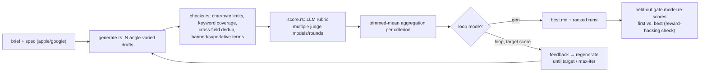
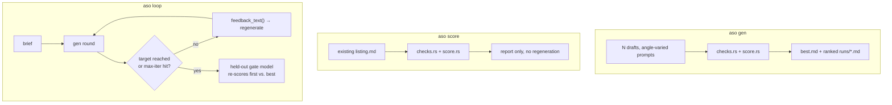
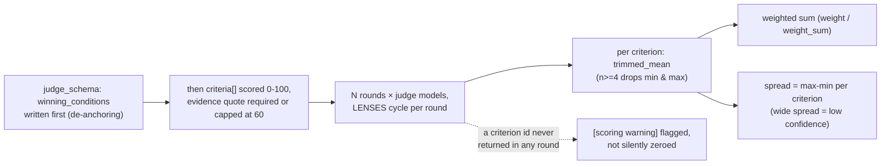

# aso-loop

A Rust CLI for app-store listing copy (title/subtitle/keywords/description): **generate N drafts → deterministic rule checks → rubric scoring → feedback-driven regeneration**.
LLM backend is the Claude Code CLI (`claude -p`) as a subprocess — no separate API key required.

Ported from [Loop-Suite/bizplan-loop](https://github.com/Loop-Suite/bizplan-loop) (the same "generate N → rule-check → LLM rubric score → regenerate" pattern, for business-plan drafting) into the ASO (App Store Optimization) domain. The `claude -p` invocation shape, the stdin/stdout-on-separate-threads handling, JSON-schema enforcement, and de-anchoring/held-out-gate scoring mechanics are unchanged from the original. Only the domain logic (spec fields, deterministic checks, prompts) is new.

## Pipeline

### Overview



### CLI modes



### Scoring detail



## Requirements

- Rust 1.70+
- `claude` CLI installed and logged in (use `--claude-bin` if not on PATH)

## Build

```bash
cargo build --release   # target/release/aso
```

## Three modes

```bash
# 1) generate N drafts + score + rank
aso --model sonnet --judge-model haiku \
  gen --spec specs/example-apple.toml --brief brief.md -n 6 --rounds 2 --concurrency 3 --out runs/apple

# 2) score an existing listing only
aso --judge-model sonnet,haiku \
  score --spec specs/example-apple.toml --input listing.md --rounds 3 --out runs/check

# 3) self-improvement loop toward a target score (+ held-out check)
aso --model opus --judge-model sonnet --gate-model haiku \
  loop --spec specs/example-google.toml --brief brief.md --target 85 --max-iter 4 --out runs/loop
```

`--brief` is an md/txt file with the app's overview, core features, target users, and differentiation vs. competing apps. If it contains claims that aren't true, the model will reflect them in the copy as-is, and that inaccurate copy can still pass scoring and checks.

## Backend behavior

The `claude` CLI invocation is identical to bizplan-loop's (the structure was not changed).

```
claude -p --output-format json --safe-mode --no-session-persistence --tools "" \
       [--model M] [--append-system-prompt S] [--json-schema SCHEMA] [--max-budget-usd X]
```

| Flag | Reason |
|---|---|
| `--safe-mode` | Don't load the working directory's CLAUDE.md/skills/plugins/hooks/MCP → reproducibility. Disable with `--load-context` |
| `--tools ""` | Fully disables built-in tools (Read/Edit/Write/Bash) → pure text generation, no file access |
| `--no-session-persistence` | No session file written. Avoids contention under parallel execution |
| `--json-schema` | Forces the scoring result into a schema. A validated object arrives in the response's `structured_output` |
| `--output-format json` | Collects `result` / `structured_output` / `total_cost_usd` |

The prompt is passed over stdin; writing stdin and reading stdout/stderr happen on separate threads simultaneously (to avoid deadlock from a saturated pipe buffer). Per-call timeout is `--timeout-secs` (default 600).

## Scoring

1. **Deterministic checks** (`checks.rs`, no LLM):
   - Per-field character-count overflow/underflow (against the store's hard limits)
   - Missing required fields
   - Keyword duplication across fields the store auto-dedups, like Apple's title/subtitle/keywords (flagged as wasted characters)
   - Actual keyword coverage vs. `target_keywords`
   - Banned terms: competitor app names/trademarks (regex, from the spec) + superlative phrases ("best"/"#1"/"no.1"/etc.) + price/discount phrasing + excessive emoji (over `emoji_max`)
2. **LLM rubric scoring**: 0–100 per criterion. Before scoring, the model must first write out "what conditions this listing needs to meet" (de-anchoring), and for every criterion it must quote the document verbatim and explain "why not a higher score." A criterion with no quoted evidence is capped at 60. Default rubric:

   | Criterion | Weight |
   |---|---|
   | keyword_relevance | 0.30 |
   | conversion_copy | 0.25 |
   | localization_quality | 0.15 |
   | readability_no_stuffing | 0.15 |
   | compliance | 0.15 |

3. **Aggregation**: `--rounds N` rounds → cycling models/lenses → trimmed mean per criterion (n≥4 drops min & max) → weighted sum.
4. **Instability signal**: per-criterion score spread (±) is shown in the report.
5. **Held-out gate** (`--gate-model`): a model that never participated in the loop re-scores only the first and best drafts. If the loop score rose but the held-out score didn't, it's flagged as scorer optimization (reward hacking).

de-anchoring, trimmed mean, held-out gate, length canary, etc. follow the same rationale (with citations) documented in bizplan-loop's `DESIGN.md`.

## Spec (`specs/*.toml`)

```toml
name = "App name (spec description)"
store = "apple"   # "apple" | "google"
context = "App overview, target users. Inserted verbatim into the prompt"
target_keywords = ["keyword1", "keyword2"]
banned_terms = ["competitor-app-1", "competitor-app-2"]   # regex, case-insensitive
emoji_max = 2

[[sections]]
id = "title"
title = "Title"
guide = "Writing guidance"
max_chars = 30       # store hard limit
min_chars = 15        # recommended minimum (low-utilization warning only)
required = true
keyword_dedup_target = true   # true only for Apple's title/subtitle/keywords

[[criteria]]
id = "keyword_relevance"
name = "Keyword relevance"
weight = 30
guide = "..."
```

Bundled specs:
- `specs/example-apple.toml` — title (≤30 chars) / subtitle (≤30 chars) / keywords (≤100) / promo_text (≤170, optional) / description (≤4000 chars)
- `specs/example-google.toml` — title (≤30 chars) / short_description (≤80 chars) / long_description (≤4000 chars)

**Whether Apple's 100-character keywords-field limit is character-based or byte-based is unconfirmed** (App Store Connect's official docs don't clarify this, and there are reports of a perceptible difference with multi-byte characters). This project computes it as a character count (`chars().count()`), and shows an `[unconfirmed]` warning in the report once the keywords field passes 90% of the limit — **verify directly in App Store Connect before actually submitting.**
(Circumstantial, not a primary source: an [Apple Developer Forum thread 705360](https://developer.apple.com/forums/thread/705360) reports that 100 three-byte Thai characters passed the keywords field, suggesting a "character count" basis rather than "byte count" — but Apple's official OpenAPI spec (`AppInfoLocalizationCreateRequest`, etc.) doesn't declare a `maxLength` for this field at all, so it can't be confirmed either way.)

## Open-source attribution

`src/checks.rs`'s `normalize_keyword` / `sanitize_keywords` / `normalize_text_for_match` were rewritten in Rust based on logic from [semihcihan/App-Store-Optimization-CLI](https://github.com/semihcihan/App-Store-Optimization-CLI) (MIT License) —
`cli/domain/keywords/policy.ts` (`normalizeKeyword`, `sanitizeKeywords`) and `cli/shared/aso-keyword-utils.ts` (`normalizeTextForKeywordMatch`) — porting the normalization/dedup algorithm, not copying code. The original uses `.normalize("NFKC")` plus a Unicode regex (`\p{L}\p{N}\p{M}`); this project approximates that with `char::is_alphanumeric()` instead of adding the `unicode-normalization` crate (not a full NFKC equivalent). This normalization function underlies both the cross-field keyword-duplication check and the target-keyword coverage calculation.

`furkancingoz/aso-skill` has no declared license (NOASSERTION), so its code was not consulted.

## Limitations & assumptions

- LLM scores do not guarantee actual store search ranking or review approval. Intended for **relative comparison** and **direction for improvement** within the same spec and scoring model.
- If the generation and scoring models are the same, it tends to rate its own style generously (a warning is printed if `--judge-model` isn't set).
- Keyword coverage only checks whether a normalized target-keyword string appears as a substring of the normalized text. There's no stemming or morphological analysis, so an inflected form (e.g. Korean "가계부는" for "가계부") is still caught, but a genuine synonym can be missed.
- Banned-term checks cover the spec's regex list plus the default superlative/price patterns — they do not cover the full App Store review policy.
- Apple's keywords-field character basis (characters vs. bytes) is unconfirmed — see "Open-source attribution" above.
- `claude -p` doesn't expose temperature → draft diversity comes only from angle prompts.
- Output is Markdown (`## Field Name` headings). Copying it into the actual App Store Connect / Google Play Console forms is out of scope.

## Multi-lens review findings applied

Findings CONFIRMED by a review-panel pass (functionality/good_things/tests lenses) were applied:
- Heading-to-field matching now requires an **exact match** after alphanumeric+lowercase normalization (previously a bidirectional substring check meant "Subtitle" literally contains "Title" as characters, causing mismatches).
- `Spec::load` now errors if `banned_terms` contains a regex that fails to compile (previously it was silently dropped, silently disabling that check).
- Fixed the single-character exclusion in the cross-field duplicate-keyword check to use char count instead of byte length (a bug that let a single Korean character through unfiltered).
- If a judge model never returns a score for some criterion id, that's now flagged as a warning instead of being silently treated as zero.
- A panicking worker thread in parallel execution no longer propagates the panic to the whole process.
- Fixed a test that claimed to verify `banned_term` detection but never actually exercised it, and added boundary-value (character count exactly at the limit) and case-normalization tests.

## Judgment calls made while scaffolding

- Used `--brief` instead of `--idea` as the flag name (a business-plan "idea" doesn't fit; an "app overview brief" is more apt for ASO).
- `min_chars` (recommended minimum length) is not a store-enforced value — it's a concept this project introduced for a "low utilization" warning. The example TOML's values (e.g. title ≥15 chars) are also arbitrary recommendations; only `max_chars` is an actual hard limit.
- The emoji threshold (`emoji_max` default 3, example spec uses 2) and the default banned-term patterns (superlative phrases, price phrasing) are this project's own concretization of "configurable threshold" per the user's request — not figures taken from an actual store policy document.
